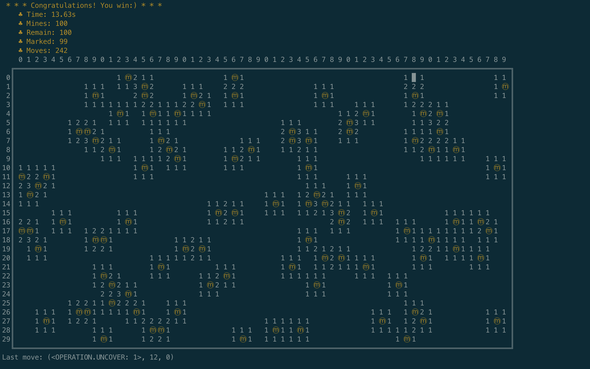
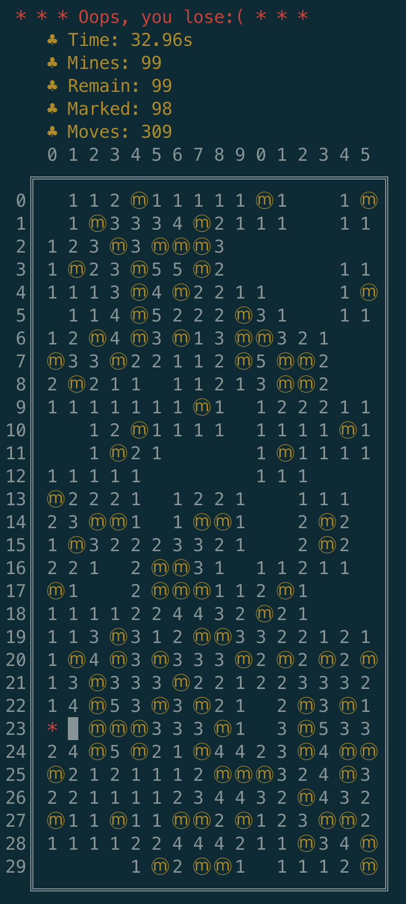

# Mine Sweeper

> A simple mine sweeper in console with auto-playing .

## Requirements

- python3
- termcolor==1.1.0

## Run

```shell
$ python play.py
# Type `[rows] [cols] [mines] man / auto` to start a game.
# e.g., `20 30 30 auto`
# In manual mode, use `[operation] [row] [col]` to uncover / mask a cell.

# In auto mode, sleep 0.05s each move so that you can see the precess clearly.
```

## Screenshots

### Start a game(manual playing)


### Automatic playing game



### Losing game



## TODO
- Advanced inference algorithm