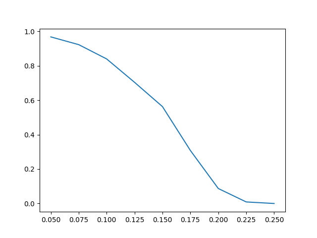
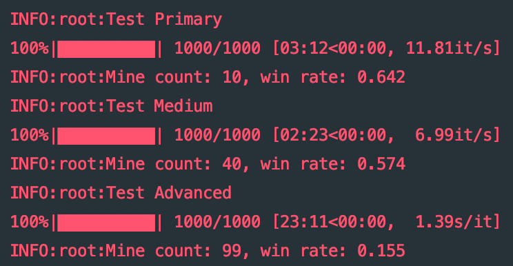
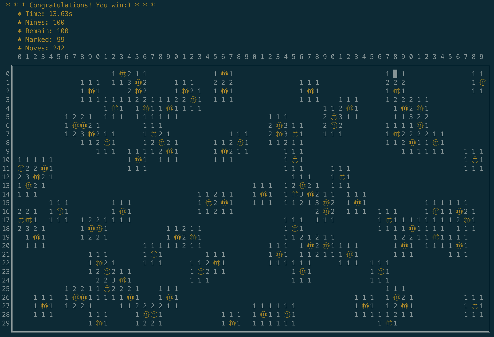

# Mine Sweeper

> A simple mine sweeper in console with auto-playing algorithm.

## Requirements

- python3

### Play part

- termcolor==1.1.0

### Test part(you don't have to care if you intend merely playing)

- tqdm==4.32.1
- matplotlib==3.0.3

## Algorithm

### Naive inference

- Inference: whether unknown cells around a known cell are all mines / clean.

### Advanced inference

- Inference based on searching all feasible solutions.
  - Use Union-Find algorithm to distinctive group constraints.
  - Use backtracking algorithm to find all feasible solutions in all cell groups.
  - Remove impossible solutions whose number of mines is larger than number of remain mines.
  - Find common inferences in all solutions for each cell group.

### Probabilistic inference

- Inference based on all solutions from advanced inference.
  - Use inference with maximum probabilistic in all solutions.

### Random inference

- Inference based on random numbers.

### Mixed Strategy

- Basically, the auto mine-bot searches moves in this order(if no moves are generated,  go to next move):
  -  `Naive -> advanced -> probabilistic -> random`.

## Test Results

Test 40 * 40 shape board with mine rate being 0.050, 0.075, …,  0.250.

Test 1000 rounds of games for each mine rate.




### Classical game

Settings in windows version(from wikipedia):

- Primary: 8 × 8, 10mines（[Windows 98](https://zh.wikipedia.org/wiki/Windows_98)or before）/9 × 9, 10mines（[Windows 2000](https://zh.wikipedia.org/wiki/Windows_2000)or later）

- Medium: 16 × 16, 40mines
- Advanced: 30 × 16, 99mines



## Run

```shell
$ python play.py
# Type `[rows] [cols] [mines] man / auto` to start a game.
# e.g., `20 30 30 auto`
# In manual mode, use `[operation] [row] [col]` to uncover / mask a cell.
# In auto mode, default sleep 0.05s each move so that you can see the precess clearly.
```

## Screenshots

### Start a game(manual playing)


### Automatic playing game



### Losing game


